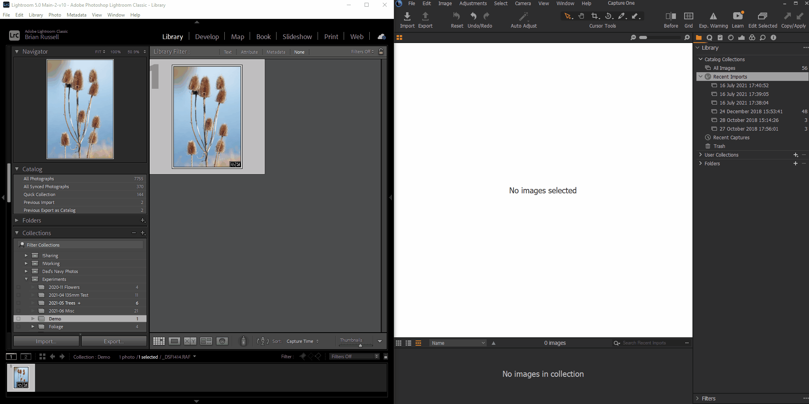
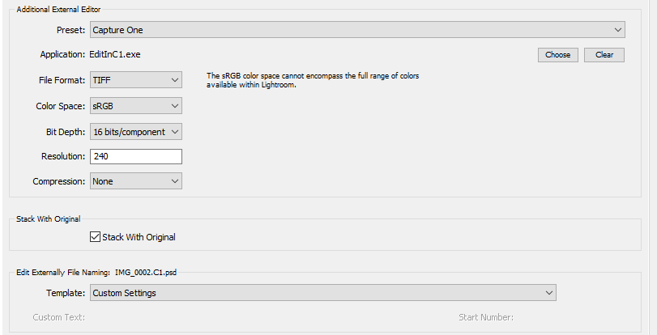
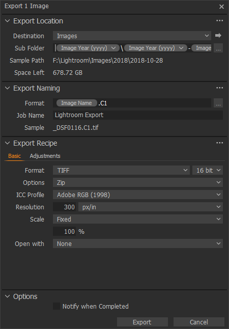
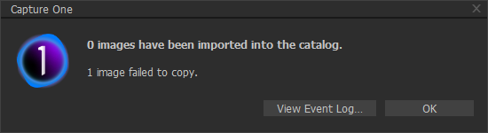

# Lightroom Edit In Capture One
EditInC1 is a small shim program to allow the easy demosaicing of a raw Lightroom managed RAW file by Capture One via the Edit In option.

# Setup

1. Create an "Edit in" profile in Lightroom, choosing the correct location of "EditInC1.exe" as follows:

Make sure to add `.C1` to the base filename as above.  

2. In Capture One, create an Export Profile (if you have the express edition) or Process Recipe if you have a pro version that exports a file to TIFF with the image name suffixed with `.C1`

# Use
1. Right Click the original raw file in Lightroom (DNG etc) and choose "Edit in Capture One"
2. Lightroom will write out the export TIF file (e.g. `_DSF0116.RAF`)
3. EditInC1 will use the path given by lightroom to find the raw file with the same name and no .C1 suffix
4. It will then **delete the original TIFF** that Lightoom generated. This is necessary as Capture One has no overwrite option in export
5. It will then launch Capture One and the import dialogue for that file. Be sure to select `Add to Catalog` in the `Import To` section so as not to duplicate your raw files unecessarily
6. Do any basic adjustments and export the TIFF using the export profile as above
7. Lightroom with still remember that it created the .C1 TIFF file and reflect the changes when they are written

# Notes
1. Extensions of common raw types are included in the configuration file `appsettings.json` place this file where you have the executable and edit if your raw type file is not included.  

2. If you use this round trip on the same file twice, Capture One will show an error like this:

as you already imported the file the first time.
If you don't want to see this then delete the image from the catalogue before exporting it the first time, but **be sure not to delete the original raw file from disk!**